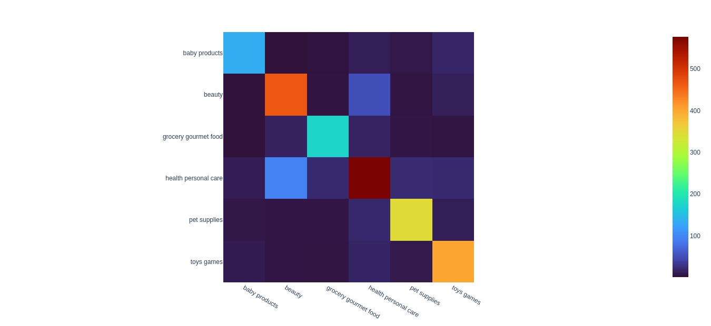

# <center>Hierarchical-Text-Classification</center>
#### Data Description
| Productid:  | Unique ID of product            |   
|-------------|---------------------------------|
| Title:      | Title of review                 |
| userId:     | Unique ID of user               |
| Time:       | Timestamp of review             |
| Text:       | Review of product given by user |
| Cat1:       | First level cat                 |
| Cat2:       | Second level cat                |
| Cat3:       | Third level cat                 |   
#### Task
Perform Hierarchical Classfication to map data instance with above mentioned features to to Cat1, Cat2 & Cat3

#### Features used 
```
X = [Title, Text]
Y = [Cat1, Cat2, Cat3]
```
Data instances where a Category in ```Cat2``` or ```Cat3``` was less than 20 or 10 respectively was groupped under ```rare``` class.

This was followed by ```Data Augmentation``` for the rare class group.

### Model Architecture
The model consists of a ```BERT``` exctractor followed by 3 sequential ```Dense``` layer grown in three stages

##### Stage 1 
a. Extract convert ```title``` and ```text``` into vectors using ```BERT layer```
b. Feed this to a ```Dense layer``` and optimize on ```Cat1``` variable (with frozon ```model 2 & 3 layers```)

```
X1 = X_title | X_text
Y1 <- Cat1 predictions
```

##### Stage 2 
a. Concatenate ```X1``` and ```Y1```  to get ```X2```
b. Feed this to a ```Dense layer``` and optimize on ```Cat2``` variable (with frozon ```model 1 & 3 layers```)

```
X2 = X1 | Y1
Y2 <- Cat2 predictions
```

##### Stage 3 
a. Concatenate ```X2``` and ```Y2```  to get ```X3```
b. Feed this to a ```Dense layer``` and optimize on ```Cat2``` variable (with frozon ```model 1 & 2 layers```)

```
X3 = X2 | Y2
Y3 <- Cat3 predictions
```

### Results
|      | Weighted Precision | Weighted Recall | Weighted F1 score | Overall Accuracy |
|------|--------------------|-----------------|-------------------|------------------|
| Cat1 | 0.84               | 0.84            | 0.84              | 0.84             |
| Cat2 | 0.73               | 0.72            | 0.72              | 0.72             |
| Cat3 | 0.67               | 0.64            | 0.64              | 0.64             |


